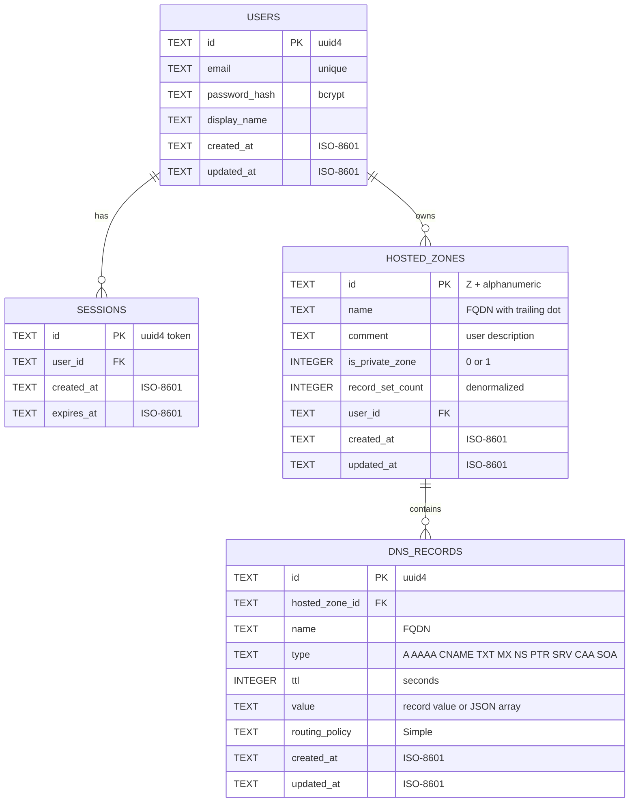

# AWS Route53 Web Application Clone

A full-stack web application cloning the **AWS Route53 console user experience** with persistent SQLite storage and a REST backend API.

---

## 1. Setup Instructions (How to Run)

### Prerequisites
- **Python**: 3.10+
- **Node.js**: 18+ & npm

---

### Step 1: Run Backend (FastAPI)

```bash
cd backend

# 1. Install dependencies
pip install -r requirements.txt

# 2. Start backend server (any of these work):
uvicorn app.main:app --reload --port 8000
# OR
uvicorn main:app --reload --port 8000
# OR
python main.py
```

> **Backend API URL**: `http://localhost:8000`  
> **Database**: Auto-creates `route53.db` on startup and seeds default credentials:
> - **Default User Email**: `admin@example.com`
> - **Default Password**: `admin123`

---

### Step 2: Run Frontend (Next.js)

Open a second terminal window:

```bash
cd frontend

# 1. Install npm dependencies
npm install

# 2. Start Next.js dev server
npm run dev
```

> **Frontend Web Console**: `http://localhost:3000`  
> Open `http://localhost:3000` in your browser to access the AWS Route53 console.

---

## 2. Architecture Overview

### 2.1 System Architecture & Layer Diagram

```
┌─────────────────────────────────────────────────────────────┐
│                        NEXT.JS FRONTEND                     │
│                                                             │
│  Pages → Hooks (state) → API Client (lib/api.ts) → fetch()  │
└──────────────────────────────┬──────────────────────────────┘
                               │ HTTP + Cookie
                               ▼
┌─────────────────────────────────────────────────────────────┐
│                        FASTAPI BACKEND                      │
│                                                             │
│  Layer 1: MIDDLEWARE                                         │
│  ┌────────────────────────────────────────────────────────┐  │
│  │  CORS config → Error handler (AppError → JSON)         │  │
│  └────────────────────────────────────────────────────────┘  │
│                               │                              │
│  Layer 2: ROUTE HANDLERS (api/*.py)                          │
│  ┌────────────────────────────────────────────────────────┐  │
│  │  Depends(get_current_user) → validates session cookie  │  │
│  │  Depends(get_db) → injects DB session                  │  │
│  │  Pydantic schema → validates request body              │  │
│  └────────────────────────────────────────────────────────┘  │
│                               │                              │
│  Layer 3: SERVICES (services/*.py)                           │
│  ┌────────────────────────────────────────────────────────┐  │
│  │  Business logic: domain validation, auto NS/SOA,       │  │
│  │  zone emptiness check, record uniqueness               │  │
│  └────────────────────────────────────────────────────────┘  │
│                               │                              │
│  Layer 4: DATABASE ACCESS                                    │
│  ┌────────────────────────────────────────────────────────┐  │
│  │  SQLAlchemy ORM → SQLite (route53.db)                  │  │
│  └────────────────────────────────────────────────────────┘  │
└─────────────────────────────────────────────────────────────┘
```

### 2.2 Route53 Sidebar Navigation Structure

The frontend sidebar navigation directly mirrors the authentic AWS Route53 Console sidebar layout:

```
Route 53                                    → /                          (redirects to /hosted-zones)
──────────────────────────────────────────
Dashboard                                   → /dashboard                 (Coming Soon)
Hosted zones                                → /hosted-zones              (FULL CRUD IMPLEMENTATION)
Health checks                               → /health-checks             (Coming Soon)
Profiles                                    → /profiles                  (Coming Soon)

▸ Global Resolver
    Global resolvers               [New]    → /resolver                  (Coming Soon)
    Shared DNS views               [New]    → /resolver                  (Coming Soon)

▸ VPC Resolver
    VPCs                                    → /resolver                  (Coming Soon)
    Inbound endpoints                       → /resolver                  (Coming Soon)
    Outbound endpoints                      → /resolver                  (Coming Soon)
    Rules                                   → /resolver                  (Coming Soon)
    Query logging                           → /resolver                  (Coming Soon)
    Outposts                                → /resolver                  (Coming Soon)

▸ Domains
    Registered domains                      → /registered-domains        (Coming Soon)
    Requests                                → /registered-domains        (Coming Soon)

▸ IP-based routing
    CIDR collections                        → /cidr-collections          (Coming Soon)

▸ Traffic flow
    Traffic policies                        → /traffic-policies          (Coming Soon)
    Policy records                          → /policy-records            (Coming Soon)

DNS Firewall                                → /dns-firewall              (Coming Soon)
Application Recovery Controller             → /recovery-controller       (Coming Soon)
```

### 2.3 End-to-End Request Dataflow Pathways

#### User Login Flow
```
Browser (login page)                        FastAPI Backend
─────────────────                           ──────────────
     │                                            │
     │  POST /api/auth/login                      │
     │  { "email": "...", "password": "..." }     │
     │ ──────────────────────────────────────────► │
     │                                            │
     │                          auth_service.login()
     │                            ├── Query users table by email
     │                            ├── Verify password hash (bcrypt)
     │                            ├── Create session row in sessions table
     │                            └── Return session token
     │                                            │
     │  200 OK                                    │
     │  Set-Cookie: session_id=<token>; HttpOnly   │
     │  { "user": { "id", "email", "display_name" } }
     │ ◄────────────────────────────────────────── │
     │                                            │
     │  Browser stores HttpOnly cookie             │
     │  Redirects to /hosted-zones                 │
```

#### Hosted Zone Creation Flow (with Auto NS/SOA Generation)
```
Browser (ZoneForm)                          FastAPI Backend
──────────────────                          ──────────────
     │                                            │
     │  POST /api/hosted-zones                    │
     │  Cookie: session_id=<token>                │
     │  { "name": "myapp.com", "comment": "...",  │
     │    "is_private_zone": false }               │
     │ ──────────────────────────────────────────► │
     │                                            │
     │                          deps.get_current_user()
     │                            └── Lookup session → get user_id
     │                                            │
     │                          hosted_zone_service.create()
     │                            ├── Validate domain name format
     │                            ├── Check for duplicate zone name
     │                            ├── Generate zone ID (Z + 13 chars)
     │                            ├── INSERT into hosted_zones
     │                            ├── Auto-create NS record
     │                            ├── Auto-create SOA record
     │                            └── Set record_set_count = 2
     │                                            │
     │  201 Created                               │
     │  { "id": "ZABC123...", "name": "myapp.com.",│
     │    "record_set_count": 2, ... }             │
     │ ◄────────────────────────────────────────── │
```

---

## 3. Database Schema & Data Modeling

### 3.1 Entity-Relationship Diagram



### 3.2 Complete Table Definitions

#### `users` — Authentication User Accounts

| Column | Type | Constraints | Description |
|---|---|---|---|
| `id` | `TEXT` | **PK**, Generated UUID | Unique user identifier |
| `email` | `TEXT` | **UNIQUE**, `NOT NULL` | Account email / login identifier |
| `password_hash` | `TEXT` | `NOT NULL` | Bcrypt hashed password |
| `display_name` | `TEXT` | `NOT NULL` | Console top bar display name |
| `created_at` | `TEXT` | `NOT NULL` | ISO-8601 creation timestamp |
| `updated_at` | `TEXT` | `NOT NULL` | ISO-8601 update timestamp |

#### `sessions` — Active Session Persistence

| Column | Type | Constraints | Description |
|---|---|---|---|
| `id` | `TEXT` | **PK** | Session token string stored in HttpOnly cookie |
| `user_id` | `TEXT` | **FK** → `users.id`, `NOT NULL` | Owning user ID |
| `created_at` | `TEXT` | `NOT NULL` | Session start timestamp |
| `expires_at` | `TEXT` | `NOT NULL` | Expiration timestamp (24h default) |

#### `hosted_zones` — Route53 Hosted Zones

| Column | Type | Constraints | Description |
|---|---|---|---|
| `id` | `TEXT` | **PK** | Format: `Z` + 13 uppercase alphanumeric chars |
| `name` | `TEXT` | `NOT NULL` | FQDN domain name ending with trailing dot |
| `comment` | `TEXT` | | User-defined description/notes |
| `is_private_zone` | `INTEGER` | `DEFAULT 0` | `0` = Public hosted zone, `1` = Private |
| `record_set_count` | `INTEGER` | `DEFAULT 2` | Total record count (starts with auto NS + SOA) |
| `user_id` | `TEXT` | **FK** → `users.id`, `NOT NULL` | Owner user ID |
| `created_at` | `TEXT` | `NOT NULL` | ISO-8601 creation timestamp |
| `updated_at` | `TEXT` | `NOT NULL` | ISO-8601 update timestamp |

#### `dns_records` — Resource Record Sets

| Column | Type | Constraints | Description |
|---|---|---|---|
| `id` | `TEXT` | **PK** | Unique record UUID |
| `hosted_zone_id` | `TEXT` | **FK** → `hosted_zones.id`, `ON DELETE CASCADE` | Parent hosted zone ID |
| `name` | `TEXT` | `NOT NULL` | FQDN record name |
| `type` | `TEXT` | `NOT NULL`, `CHECK(type IN ('A','AAAA','CNAME','TXT','MX','NS','PTR','SRV','CAA','SOA'))` | DNS record type |
| `ttl` | `INTEGER` | `DEFAULT 300` | Time-to-Live in seconds |
| `value` | `TEXT` | `NOT NULL` | Target IP address(es) or value string |
| `routing_policy` | `TEXT` | `DEFAULT 'Simple'` | Routing strategy string |
| `created_at` | `TEXT` | `NOT NULL` | ISO-8601 creation timestamp |
| `updated_at` | `TEXT` | `NOT NULL` | ISO-8601 update timestamp |

### 3.3 Database Indexes & Constraints

```sql
PRAGMA foreign_keys = ON;

-- Hosted zones indexes
CREATE INDEX idx_hosted_zones_user_id ON hosted_zones(user_id);
CREATE INDEX idx_hosted_zones_name ON hosted_zones(name);

-- DNS records indexes & uniqueness constraint
CREATE INDEX idx_dns_records_zone_id ON dns_records(hosted_zone_id);
CREATE INDEX idx_dns_records_zone_type ON dns_records(hosted_zone_id, type);
CREATE INDEX idx_dns_records_zone_name ON dns_records(hosted_zone_id, name);

CREATE UNIQUE INDEX uq_zone_name_type ON dns_records(hosted_zone_id, name, type);

-- Sessions indexes
CREATE INDEX idx_sessions_user_id ON sessions(user_id);
CREATE INDEX idx_sessions_expires_at ON sessions(expires_at);
```

### 3.4 Initial Seed Data

On initial boot, `seed.py` automatically provisions:
- **Default User**: `admin@example.com` / `admin123` / "Admin User"
- **Default Zone**: `example.com.` (Public, ID: `Z0123456789ABC`)
- **Default NS Record**: `example.com.` → `ns-001.awsdns-01.com.` (TTL: 172800)
- **Default SOA Record**: `example.com.` → `ns-001.awsdns-01.com. awsdns-hostmaster.amazon.com. 1 7200 900 1209600 86400` (TTL: 900)

---

## 4. API Overview

### 4.1 API Endpoints Table

#### Authentication (`/api/auth`)

| Method | Path | Description | Auth Required |
|---|---|---|---|
| `POST` | `/api/auth/login` | Log in user & attach HttpOnly `session_id` cookie | No |
| `POST` | `/api/auth/logout` | Invalidate session & remove session cookie | Yes |
| `GET` | `/api/auth/me` | Return active user details & mocked AWS account info | Yes |

#### Hosted Zones (`/api/hosted-zones`)

| Method | Path | Description | Auth Required |
|---|---|---|---|
| `GET` | `/api/hosted-zones` | List hosted zones (supports `search`, `page`, `page_size`) | Yes |
| `POST` | `/api/hosted-zones` | Create new hosted zone & auto-generate NS + SOA records | Yes |
| `GET` | `/api/hosted-zones/{zone_id}` | Fetch single hosted zone by ID | Yes |
| `PUT` | `/api/hosted-zones/{zone_id}` | Update hosted zone comment / privacy type | Yes |
| `DELETE` | `/api/hosted-zones/{zone_id}` | Delete hosted zone (rejects if custom records exist) | Yes |

#### DNS Records (`/api/hosted-zones/{zone_id}/records`)

| Method | Path | Description | Auth Required |
|---|---|---|---|
| `GET` | `/api/hosted-zones/{zone_id}/records` | List DNS records (supports `search`, `type`, `page`, `page_size`) | Yes |
| `POST` | `/api/hosted-zones/{zone_id}/records` | Create new DNS record in hosted zone | Yes |
| `GET` | `/api/hosted-zones/{zone_id}/records/{record_id}` | Fetch single DNS record details | Yes |
| `PUT` | `/api/hosted-zones/{zone_id}/records/{record_id}` | Update existing DNS record | Yes |
| `DELETE` | `/api/hosted-zones/{zone_id}/records/{record_id}` | Delete DNS record | Yes |

### 4.2 Query Parameters

List endpoints accept standard pagination and search parameters:

| Parameter | Type | Default | Applied On | Description |
|---|---|---|---|---|
| `search` | `string` | `""` | Zones & Records | Case-insensitive substring match on domain/record name |
| `type` | `string` | `""` | Records | Filter records by record type (`A`, `CNAME`, `TXT`, etc.) |
| `page` | `integer` | `1` | Zones & Records | 1-indexed page number |
| `page_size` | `integer` | `20` | Zones & Records | Items per page (min 1, max 100) |

### 4.3 Uniform Error Handling

API error responses follow a simple, uniform JSON structure across all endpoints:

```json
{
    "error": {
        "code": "ZONE_NOT_FOUND",
        "message": "Hosted zone with ID Z1234567890ABC does not exist."
    }
}
```

#### Common Error Codes Catalog

| HTTP Status | Error Code | Description |
|---|---|---|
| `400` | `INVALID_INPUT` | Request body failed schema validation or missing required fields |
| `400` | `INVALID_DOMAIN_NAME` | Domain name format fails validation rules |
| `400` | `ZONE_NOT_EMPTY` | Zone deletion rejected because custom DNS records still exist |
| `400` | `DUPLICATE_ZONE` | A hosted zone with this domain name already exists |
| `400` | `DUPLICATE_RECORD` | A record with the same name and type already exists in this zone |
| `400` | `INVALID_RECORD_TYPE` | Record type is not one of the 10 supported DNS record types |
| `401` | `UNAUTHORIZED` | Missing, invalid, or expired session token |
| `401` | `SESSION_EXPIRED` | Session has passed its 24-hour expiration window |
| `404` | `ZONE_NOT_FOUND` | Specified Hosted Zone ID was not found |
| `404` | `RECORD_NOT_FOUND` | Specified DNS Record ID was not found in zone |
| `500` | `INTERNAL_ERROR` | Internal application error |
